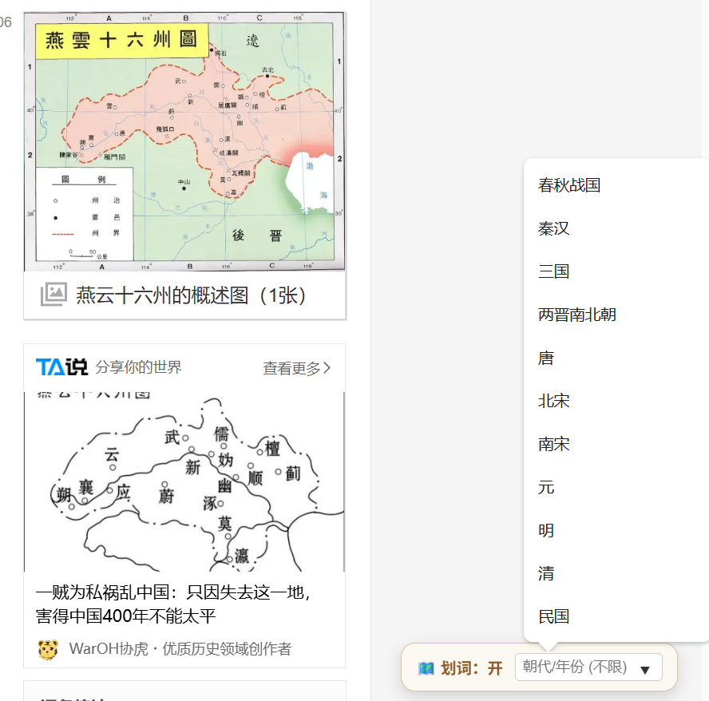
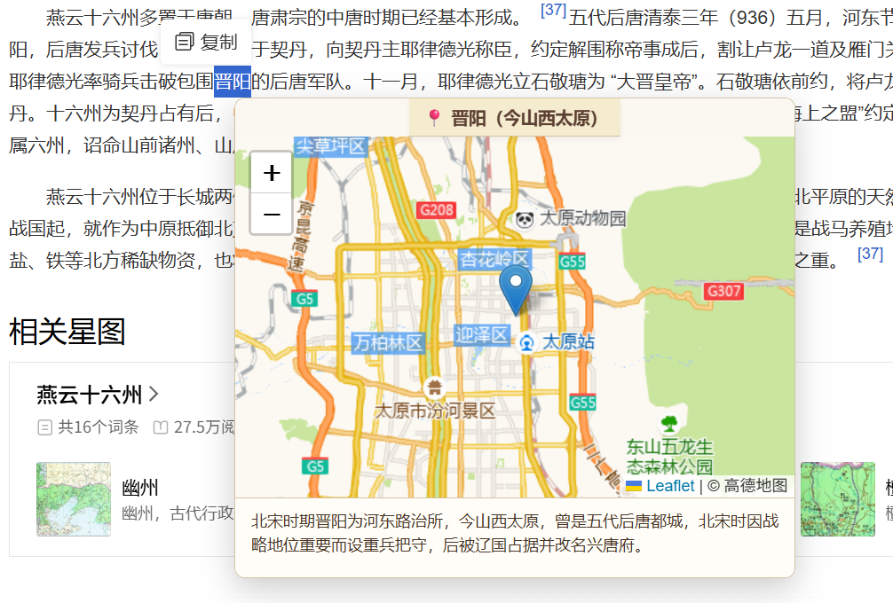

<!-- 项目顶层图标/Logo -->

  <!-- 这里的 src 指向你仓库里的图片路径 -->
  

<h1 align="center">knoWhere</h1>

  似乎并不是很快捷的快捷网页地图工具。
   
  <a href="https://github.com/Lizinfu/Knowhere/issues">报告 Bug</a>
  ·
  <a href="https://github.com/Lizinfu/Knowhere/issues">请求功能</a>

---

## 目录
- [关于项目](#关于项目)
- [具体实现](#具体实现)
- [快速开始](#快速开始)
- [使用指南](#使用指南)
- [有待优化](#有待优化)

---

## 关于项目
过去半年，作者在慢悠悠地看《如果这就是宋史》，里面涉及到了大量的地名、战役等信息，虽然作者有一些解释，但囿于本人相当有限的地理知识，对一些地方的概念依然相当模糊。
于是，作者心里萌生了做一个插件来解决这个问题的想法。选中地名，返回图片，能够让阅读更加顺利，更好地跟上作者铁马金戈、挥斥方遒的笔墨。

## 具体实现
考虑到本人贫瘠的前后端知识，代码基本由Gemini生成。目前，knoWhere仅以Chrome插件形式存在。
* **代码编写**：Gemini
* **平台工具**: Cloudflare Worker
* **LLM支持**：硅基流动-Qwen3-8B
* **地图工具**: 高德地图, leaflet

## 快速开始
knoWhere当前是非常基础的Chrome插件，将文件夹下载到本地即可。
在Chrome中进入chrome://extensions/，加载未打包的扩展程序即可使用

## 使用指南
knoWhere目前可实现**选中地名**，**选择朝代/年份**，通过云端api，返回选中地点的地理位置和简单介绍。建议读者科学上网，功能更稳定。
### 界面显示
启动插件后刷新界面，右下角会出现选择框。可选择**插件是否开启**、**输入/选择**朝代和年份。
<figure align="center">
  
  <figcaption>选择输入界面</figcaption>
</figure>

### 选择使用
顾名思义，用光标选中所选词，等待片刻，即可在弹出的小窗口内返回当前选中地点的地理位置和简单介绍。
<figure align="center">
  
  <figcaption>效果图（选择朝代为北宋）</figcaption>
</figure>

## 有待优化
纯属图一乐闹着玩的小项目，还存在许多不足，以后可能会慢慢改进。
* **迷信上网**：当前版本似乎不能在脱离科学上网的环境下稳定工作，有待改进。
* **响应时间**：本穷鬼使用的是免费的大模型api，响应速度可能在5-10s。后续一方面会想办法提速，也考虑开放让有钱的读者自行输入更高级的api。
* **界面交互**：当前显示的地图是直接调取的高德地图，对于阅读历史战役相关内容的读者来说可能有些割裂，作者也想改进一下界面的显示，包括地形显示等。
* **去插件化**：knoWhere没有进入google插件商城（依然是因为作者穷，没有开发者账号），有一个可以脱离浏览器使用的宏大愿望。~~先画个饼，反正遥遥无期~~。